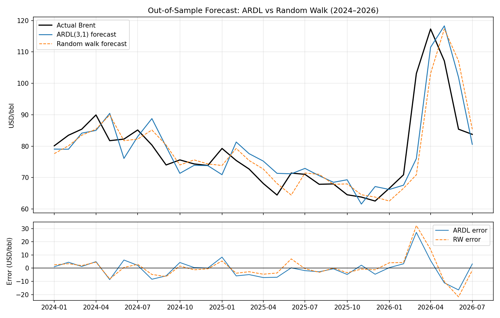

# Brent Crude Oil: ARDL Modeling, Structural Breaks & Forecast Evaluation

> **Independent research project (January 2010–July 2026)**
>
> Investigating whether inventories, the US dollar, Chinese manufacturing activity, and geopolitical risk explain short-run movements in Brent crude oil prices, and whether these relationships remained stable through the COVID-19 pandemic and the Russia–Ukraine war.

---

## Research Question

**Which macroeconomic factors remain reliable short-run predictors of Brent crude oil prices, and do these relationships remain stable during major economic and geopolitical disruptions?**

---

## Dataset

**Frequency:** Monthly

**Sample:** January 2010–July 2026

**Observations:** 199

| Variable | Source | Economic Interpretation |
| --- | --- | --- |
| Brent spot price | EIA | Dependent variable |
| US_Crude_Stocks_Total_kbbl | EIA | Inventory/supply signal |
| USD_Index | FRED/ALFRED | Currency channel |
| China_PMI_Manufacturing | NBS | Global demand proxy |
| GPR_Index | Caldara & Iacoviello | Geopolitical risk |

---

## Methodology

### Model Selection

- Lag order selected through a grid search.
- AIC used as the primary criterion.
- BIC used as a robustness check.
- Final specification: **ARDL(3,1)**.

### Model Specification

```text
Brentₜ = f(
    Brentₜ₋₁...Brentₜ₋₃,
    Stocksₜ...Stocksₜ₋₁,
    USDₜ...USDₜ₋₁,
    PMIₜ...PMIₜ₋₁,
    GPRₜ...GPRₜ₋₁
)
```

### In-Sample Performance

| Metric | Value |
| --- | --- |
| R² | 0.946 |
| Sum of AR coefficients | 0.902 |

---

## Key Findings

| Research Question | Conclusion |
| --- | --- |
| Is Brent persistent? | Yes (AR persistence = 0.902) |
| Which variables matter most? | USD Index and geopolitical risk |
| Is there a long-run equilibrium? | No |
| Are coefficients stable over time? | No |
| Does ARDL outperform a random walk? | Not significantly |

---

## Cointegration Analysis

### Bounds Test (Pesaran, Shin, and Smith, 2001)

> **Finding:** No evidence of a stable long-run relationship.

**Bounds F-statistic: 3.099**

| Significance Level | I(0) | I(1) |
| --- | --- | --- |
| 10% | 2.45 | 3.52 |
| 5% | 2.86 | 4.01 |
| 1% | 3.74 | 5.06 |

**ECT t-statistic (Brentₜ₋₁): -2.556**

| Significance Level | I(0) | I(1) |
| --- | --- | --- |
| 10% | -2.57 | -3.66 |
| 5% | -2.86 | -3.99 |
| 1% | -3.43 | -4.60 |

**Interpretation**

- F-test: inconclusive at the 10% and 5% levels.
- ECT t-test: no evidence of cointegration.
- Brent's determinants appear to operate through short-run adjustments rather than a stable long-run equilibrium.

---

## Structural Breaks

**Chow tests identified two significant break dates:**

- February 2020 (COVID-19)
- February 2022 (Russia–Ukraine war)

A rolling 30-month regression revealed substantial parameter instability.

| Variable | Rolling-window evidence |
| --- | --- |
| USD_Index | Sign reversal across the sample period |
| GPR_Index | Sensitivity increases after 2022 |
| China_PMI | Demand signal weakens during 2020–2022 |


*Figure 2. Rolling 30-month coefficient estimates showing parameter instability across the sample period.*

---

## Forecast Evaluation

**Method**

- Expanding-window walk-forward evaluation.
- One-step-ahead forecasting.
- Benchmark: random walk.

| Metric | ARDL(3,1) | Random Walk |
| --- | --- | --- |
| RMSE | 7.534 | 8.419 |
| MAE | 5.329 | 5.260 |
| Error standard deviation | 7.519 | 8.417 |

**Diebold–Mariano test**

| Statistic | p-value |
| --- | --- |
| -1.068 | 0.285 |

> **Finding:** The model explains historical price movements but does not significantly outperform a random-walk forecast.

> **Caveat:** Forecasts use realized future values of the explanatory variables (conditional/ex-post forecasts) rather than recursively forecasting all explanatory variables.



*Figure 3. Out-of-sample forecast performance compared with a random-walk benchmark.*

---

## Limitations

- Potential endogeneity between Brent, USD_Index, and China_PMI.
- VAR and Granger causality could provide additional robustness checks.
- Additional residual diagnostics could strengthen the forecasting analysis.

---

## Tools

`Python` • `NumPy` • `pandas` • `SciPy`  • `Jupyter Notebook`
